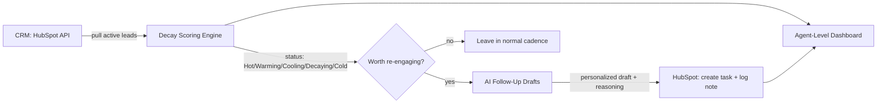

# Lead Decay Monitor

Auto-detects high-intent CRM leads going cold and routes them back into an outreach queue before they're lost, instead of waiting for a sales rep to notice.

Built to demonstrate a lead-decay monitoring system I designed and shipped in production at a real estate investment platform (HubSpot + an LLM-generated follow-up layer), where it saved reps 15+ hours/week of manual pipeline triage. This repo is a clean-room rebuild: original code, a synthetic CRM schema, and no employer data, so it's safe to read, run, and fork.

## The problem this solves

A lead that filled out a high-intent form (booked a call, downloaded pricing) and then went quiet for 9 days is a very different problem than a cold newsletter subscriber who's been quiet for 9 days. Most CRMs only give you "last activity date," with no sense of urgency relative to how hot the lead actually was. Reps end up either manually scanning the pipeline for leads worth chasing, or missing them entirely until they've fully gone cold.

This system scores every lead's **decay**, not just their staleness, by comparing days-since-last-touch against a decay curve calibrated to how intent-heavy that lead's source and engagement history were. A demo-request lead decays fast (hours matter). A newsletter signup decays slowly. The system classifies every lead into one of five statuses, generates a personalized re-engagement draft for the ones worth chasing, and writes the queue back into the CRM as tasks.

## Architecture



## The five-status model

| Status | Trigger | Action |
|---|---|---|
| **Hot** | High intent score, touched within the source's expected window | No action, still in active cadence |
| **Warming** | Approaching the decay threshold, engagement trending up | Flagged for awareness only |
| **Cooling** | Past the expected touch window for its intent tier | Queued for a follow-up draft |
| **Decaying** | Significantly overdue relative to intent tier | Prioritized follow-up + task created for the owning rep |
| **Cold** | Past the max re-engagement window | Removed from active queue, routed to long-term nurture |

The decay threshold isn't a flat number of days, it's `expected_touch_window(source, engagement_score)`, so a demo-request lead and a content-download lead decay on different clocks. See `src/scoring.py`.

## What's actually in here

- `src/scoring.py` — the decay scoring engine: intent-tier calibration, five-status classification, pure functions with unit tests
- `src/hubspot_client.py` — a real HubSpot API wrapper (contacts, deals, tasks, notes) using the v3 REST API; works against a live portal if you supply an API key
- `src/ai_followup.py` — generates a short, specific re-engagement draft per lead using the Anthropic API, grounded in *why* that lead is decaying (not a generic "just checking in")
- `src/pipeline.py` — orchestrates the full run: pull → score → classify → draft → write back → summarize
- `src/dashboard.py` — rolls the run up into a per-rep summary (how many leads each rep has decaying, oldest decaying lead, etc.)
- `data/sample_leads.csv` — 40 synthetic leads spanning all five statuses and a realistic spread of engagement scores, used by the demo
- `tests/test_scoring.py` — unit tests for the scoring engine, including a regression test for a threshold-rounding edge case that could otherwise make the WARMING status unreachable at low engagement scores
- `tests/test_pipeline.py` — tests for the orchestration layer itself (which statuses get a follow-up drafted, task priority assignment)
- `run_demo.py` — calls the exact same `src.pipeline.run_pipeline()` that `--live` mode uses, just with mocked HubSpot/Claude clients injected, no API keys required, prints a full report to the console

## Running it

```bash
pip install -r requirements.txt

# Demo mode — no credentials needed, runs against data/sample_leads.csv
python run_demo.py

# Real mode — set HUBSPOT_API_KEY and ANTHROPIC_API_KEY in .env (see .env.example)
python -m src.pipeline --live
```

Actual output from `python run_demo.py` against the sample data:

```
LEAD DECAY REPORT
────────────────────────────────────────────
HOT         18 leads   (no action)
WARMING      6 leads   (flagged)
COOLING      9 leads   (follow-up queued)
DECAYING     5 leads   (priority — task created)
COLD         2 leads   (routed to nurture)

Priority follow-ups this run: 5
  → Ritika Bansal (newsletter_signup, 6d overdue) — task assigned to rep_010
  → Harshad Pillai (content_download, 4d overdue) — task assigned to rep_009
  → Varun Chopra (webinar_attendee, 2d overdue) — task assigned to rep_007
  → Sneha Kapoor (demo_request, 0d overdue) — task assigned to rep_001
  → Aryan Bose (pricing_page, 0d overdue) — task assigned to rep_005

Rep summary (cooling + decaying leads owned):
  rep_010: 2 leads needing follow-up, oldest 6 days overdue (Ritika Bansal)
  rep_009: 2 leads needing follow-up, oldest 4 days overdue (Harshad Pillai)
  rep_001: 2 leads needing follow-up, oldest 3 days overdue (Imran Sheikh)
  ...
```

## Stack

Python 3.11, HubSpot CRM API v3, Anthropic API (Claude) for follow-up generation, `pytest` for tests. No framework, no database, deliberately dependency-light so the logic is easy to read end to end.

## Why this design

The scoring engine is pure and unit-tested on purpose, decay classification is the one piece of business logic a hiring team will actually want to read closely, so it's isolated from the API clients and fully testable without network calls. The AI follow-up layer is grounded in the specific reason a lead is decaying (source, days overdue, last engagement) rather than prompting for a generic message, which is what made the real version usable enough for reps to actually send without heavy editing.
